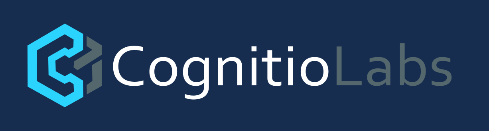

# ShellPoint

<div align="center">



**Professional Web-Based SSH Client**

[](https://opensource.org/licenses/MIT)
[](https://github.com/cognitiolabs/shellpoint)
[](https://nodejs.org/)

*Developed by [CognitioLabs](https://cognitiolabs.eu)*

</div>

## 🚀 Features

- **🔐 Secure Authentication** - JWT-based authentication with bcrypt password hashing
- **🔑 SSH Key Support** - RSA, ED25519, and ECDSA key authentication
- **📑 Multiple Sessions** - Handle multiple SSH connections in tabs
- **🎨 Terminal Themes** - 8 beautiful terminal color schemes (Dracula, Nord, Tokyo Night, etc.)
- **👤 User Profiles** - Manage user settings and preferences
- **💾 Connection Manager** - Save and organize SSH connections with descriptions
- **🌐 Modern UI** - Beautiful, responsive interface with Material Design icons
- **🔒 SSH Keys Vault** - Securely store and manage SSH private keys
- **🐳 Docker Ready** - Easy deployment with Docker and docker-compose

## ⚡ Quick Start

### Using Docker (Recommended)

```bash
# Run with docker-compose
docker-compose up -d

# Or run directly
docker run -d \
  -p 8080:8080 \
  -e JWT_SECRET="your-random-secret-key-here" \
  -v shellpoint-data:/app/data \
  ghcr.io/cognitiolabs/shellpoint:latest
```

### Using Node.js

```bash
# Clone repository
git clone https://github.com/cognitiolabs/shellpoint.git
cd shellpoint

# Install dependencies
npm install

# Create .env file
echo "JWT_SECRET=$(node -e \"console.log(require('crypto').randomBytes(64).toString('hex'))\")" > .env

# Start application
npm start
```

Visit `http://localhost:8080` and create your first account!

## 📦 Installation

### Prerequisites

- **Node.js** >= 20.x
- **npm** >= 9.x
- **Docker** (optional, for containerized deployment)

### Local Installation

1. **Clone the repository:**
   ```bash
   git clone https://github.com/cognitiolabs/shellpoint.git
   cd shellpoint
   ```

2. **Install dependencies:**
   ```bash
   npm install
   ```

3. **Set up environment variables:**
   ```bash
   cp .env.example .env
   # Edit .env and set JWT_SECRET
   ```

4. **Start the application:**
   ```bash
   # Production
   npm start

   # Development (with auto-reload)
   npm run dev
   ```

## ⚙️ Configuration

### Environment Variables

Create a `.env` file in the project root:

```env
# Required
JWT_SECRET=your-cryptographically-secure-random-key

# Optional
PORT=8080
DB_PATH=./ssh-client.db
NODE_ENV=production
```

### Generate Secure JWT Secret

```bash
node -e "console.log(require('crypto').randomBytes(64).toString('hex'))"
```

## 🎯 Usage

### First Time Setup

1. Navigate to `http://localhost:8080`
2. Click **Register** and create an account
3. Log in with your credentials

### Adding SSH Connections

1. Click **"Add Connection"** button
2. Fill in connection details:
   - **Name**: Friendly name for the connection
   - **Host**: Server hostname or IP
   - **Port**: SSH port (default: 22)
   - **Username**: SSH username
   - **Description**: Optional notes
3. Choose authentication method:
   - **Password**: Enter SSH password
   - **SSH Key**: Select from vault or add new key
4. Click **Save**

### Managing SSH Keys

1. Click the **key icon** 🔑 in the sidebar
2. Click **"Add SSH Key"**
3. Provide:
   - Key name
   - Private key content (or upload file)
   - Passphrase (if encrypted)
   - Key type (RSA/ED25519/ECDSA)
4. Use keys in connections via **SSH Key** authentication

### Terminal Themes

1. Click your **username** in the sidebar
2. Select **Terminal Theme** from dropdown
3. Choose from 8 themes:
   - Default, Dracula, Monokai, Nord
   - One Dark, Solarized Dark, Gruvbox, Tokyo Night

## 🐳 Docker Deployment

### Using docker-compose (Recommended)

```bash
# Start
docker-compose up -d

# View logs
docker-compose logs -f

# Stop
docker-compose down

# Stop and remove data
docker-compose down -v
```

### Using Docker CLI

```bash
# Build image
docker build -t shellpoint:latest .

# Run container
docker run -d \
  --name shellpoint \
  -p 8080:8080 \
  -e JWT_SECRET="your-secret" \
  -v shellpoint-data:/app/data \
  shellpoint:latest
```

## 🛠️ Development

### Project Structure

```
shellpoint/
├── server.js              # Express server & WebSocket
├── public/
│   ├── index.html        # Frontend UI
│   ├── app.js            # Client-side logic
│   └── style.css         # Additional styles
├── .env.example          # Example environment config
├── Dockerfile            # Docker image definition
├── docker-compose.yml    # Docker compose config
└── docs/
    └── knowledge-base.md # Development documentation
```

### Tech Stack

**Backend:** Node.js, Express, WebSocket (ws), SSH2, Better-SQLite3, bcrypt, JWT

**Frontend:** Vanilla JavaScript, Tailwind CSS, xterm.js, Material Design Icons

## 🔒 Security

### Current Security Features

✅ JWT authentication with httpOnly cookies
✅ bcrypt password hashing (salt rounds: 10)
✅ Secure cookie flags (secure, sameSite)
✅ Input validation (port range, host format)
✅ Password strength requirements (min 8 chars, letter + number)
✅ Environment-based JWT secret

### Production Recommendations

⚠️ **Database Encryption**: Currently, SSH keys and passwords are stored in plaintext in SQLite. For production use, implement encryption at rest.

⚠️ **HTTPS**: Always use HTTPS in production. Use a reverse proxy (nginx/Traefik) with valid SSL certificates.

⚠️ **Rate Limiting**: Implement rate limiting on authentication endpoints to prevent brute force attacks.

## 📄 License

This project is licensed under the MIT License - see the [LICENSE](LICENSE) file for details.

## 🙏 Acknowledgments

- [xterm.js](https://xtermjs.org/) - Terminal emulator
- [SSH2](https://github.com/mscdex/ssh2) - SSH client library
- [Tailwind CSS](https://tailwindcss.com/) - CSS framework
- [Material Icons](https://fonts.google.com/icons) - Icon library

## 📞 Support

- **Issues**: [GitHub Issues](https://github.com/cognitiolabs/shellpoint/issues)
- **Website**: [https://cognitiolabs.eu](https://cognitiolabs.eu)
- **Email**: info@cognitiolabs.eu

---

<div align="center">

**Made with ❤️ by [CognitioLabs](https://cognitiolabs.eu)**

[Website](https://cognitiolabs.eu) · [GitHub](https://github.com/cognitiolabs) · [Documentation](https://github.com/cognitiolabs/shellpoint/blob/main/docs/knowledge-base.md)

</div>